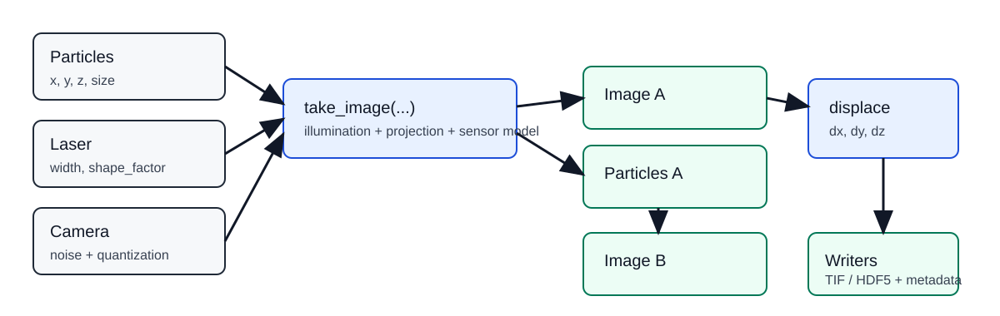
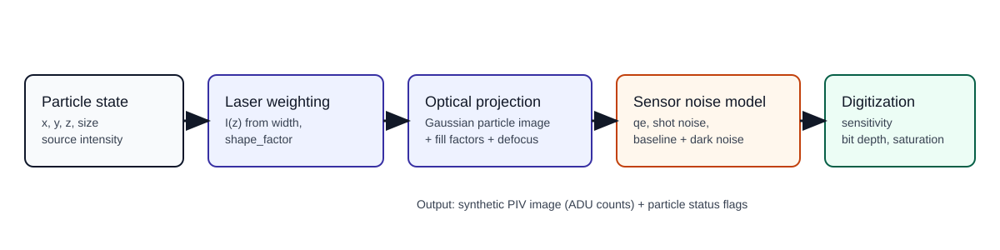

Simulation Overview
===================

`synpivimage` simulates a full synthetic PIV image-formation pipeline. The goal is to generate image pairs and metadata
that let you test PIV algorithms under controlled conditions.

   End-to-end workflow from particle/camera/laser inputs to image pair and output writers.

Simulation workflow
-------------------

Particle state definition
^^^^^^^^^^^^^^^^^^^^^^^^^

Particles are represented by position and size arrays (`x`, `y`, `z`, `size`).
You can provide particles directly or generate distributions with `Particles.generate(...)`.

Laser illumination model
^^^^^^^^^^^^^^^^^^^^^^^^

Laser sheet intensity is applied as a function of particle `z` location via `Laser(width, shape_factor)`.
The model supports Gaussian-like and top-hat-like profiles through `shape_factor`.

Optical image formation
^^^^^^^^^^^^^^^^^^^^^^^

Illuminated particles are projected onto the camera grid using a Gaussian particle-image model with pixel fill factors
(`fill_ratio_x`, `fill_ratio_y`).
Optional defocus blur is available through `Camera(focus_plane_z, defocus_strength)`.

Sensor/noise model
^^^^^^^^^^^^^^^^^^

Photon-to-electron conversion (`qe`), shot noise (`shot_noise=True`), dark/read noise (`baseline_noise`,
`dark_noise`), and digital conversion (`sensitivity`, `bit_depth`) are applied.
Images are quantized to camera bit depth and saturated at sensor max count.

   Internal image-formation stages used to produce a synthetic PIV frame.

Outputs
^^^^^^^

In-memory arrays: `img, particles = take_image(...)`.

On-disk data:

- `Imwriter`: TIF images + JSON-LD component/particle metadata.
- `HDF5Writer`: image stacks and particle datasets in one HDF5 file.

Flags and particle status
-------------------------

The simulation tracks particle visibility in each frame (in field-of-view, illuminated, out-of-plane, disabled) using
internal bit flags in `Particles.flag`. This enables quantitative analysis of valid and lost particles across image
pairs.
